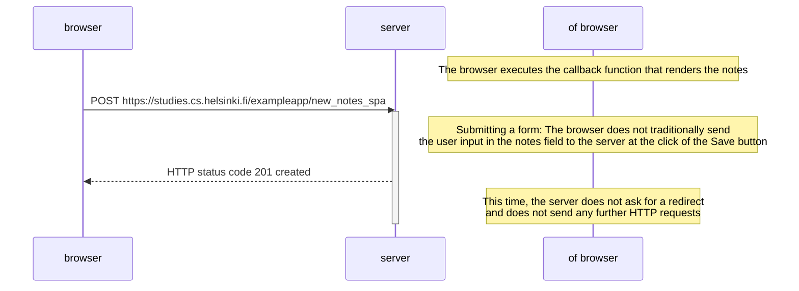

```mermaid
sequenceDiagram
    participant browser
    participant server

    Note over of browser: The browser executes the callback function that renders the notes

    browser->>server: POST https://studies.cs.helsinki.fi/exampleapp/new_notes_spa 
    activate server
    
    Note over of browser: Submitting a form: The browser does not traditionally send <br/>the user input in the notes field to the server at the click of the Save button

    server-->>browser: HTTP status code 201 created
    Note over of browser: This time, the server does not ask for a redirect <br/>and does not send any further HTTP requests
    deactivate server


```