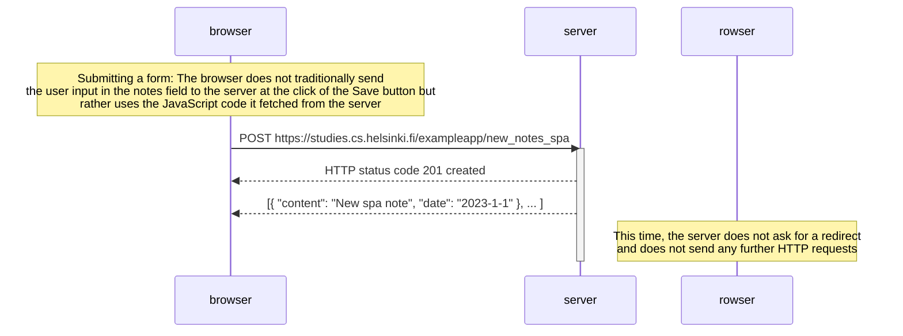

# 0.6: New Note Single Page App Diagram

```mermaid
sequenceDiagram
    participant browser
    participant server
    
    Note over browser: Submitting a form: The browser does not traditionally send <br/>the user input in the notes field to the server at the click of the Save button but <br/>rather uses the JavaScript code it fetched from the server
    
    browser->>server: POST https://studies.cs.helsinki.fi/exampleapp/new_notes_spa 
    activate server

    server-->>browser: HTTP status code 201 created
    server-->>browser: [{ "content": "New spa note", "date": "2023-1-1" }, ... ]
    Note over rowser: This time, the server does not ask for a redirect <br/>and does not send any further HTTP requests
    deactivate server
```
